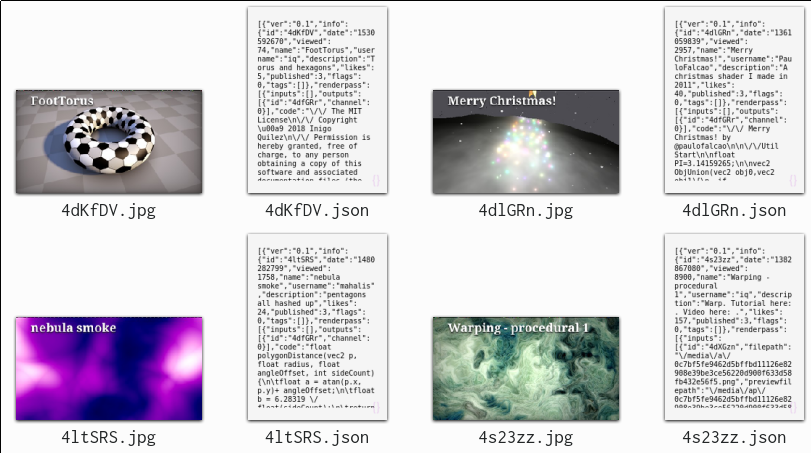

### Shade it! - Shadertoy viewer/editor

Start with shader hash to autodownload json and assets.  
`./shade_it 4dKfDV`  
Drag and Drop from Shadertoy.com.
Drag and Drop json from assets/glsl/st/  
Stores json and screenshots in assets folder.  

Middle mouse button to switch shader.  
Press n to create new shader, will open in Editor  
If file is changed and saved it should autocompile, press c to do that manually.  
Adjust your editor before compiling:  
`#define EDITOR	 "/usr/bin/kate"`  
P to toggle rendering/pause.  
S to override screenshot.  
ESC to quit.  

Screenshots:  
  

Dependencies:  
SDL2/SDL2_image/glew/curl/jansson  

[Get in touch on SDL-Discourse](https://discourse.libsdl.org/u/Acry/summary)

Useful links:  
[SDL2](https://www.libsdl.org/) | [SDL-Discourse](https://discourse.libsdl.org) | [SDL2-Example Code](https://gist.github.com/Acry/baa861b8e370c6eddbb18519c487d9d8) | [N. Nopper-Code](https://github.com/McNopper/OpenGL) | [McKesson-Book](https://paroj.github.io/gltut/) | [Íñigo Quílez](http://www.iquilezles.org/prods/index.htm)  |  [shadertoy](https://www.shadertoy.com/)